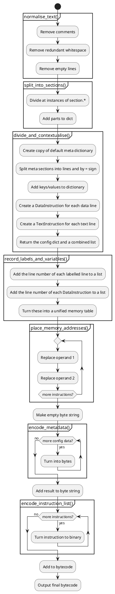
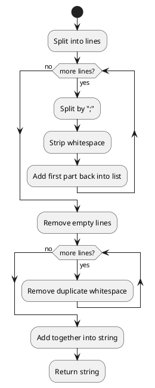
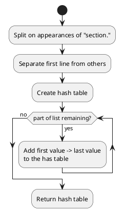
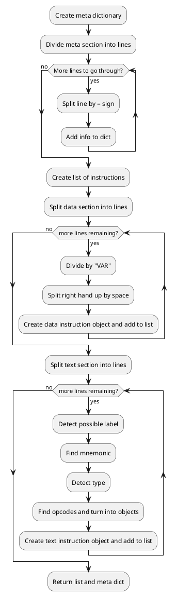
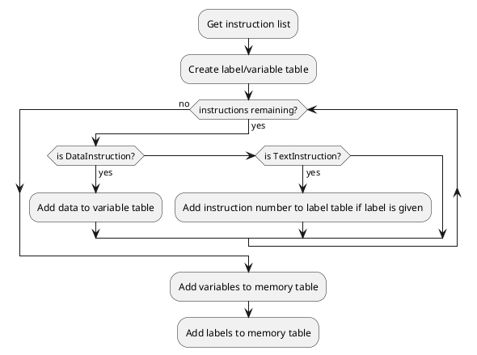
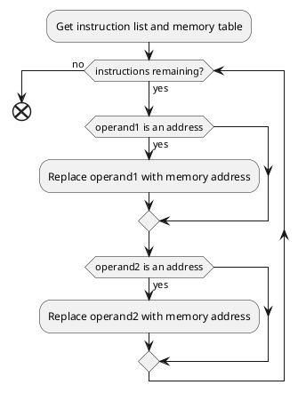
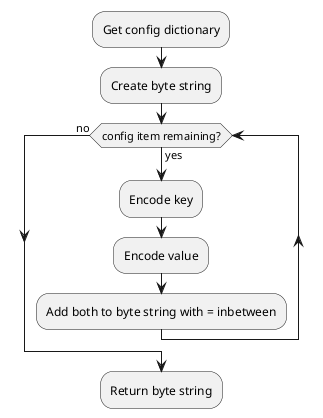
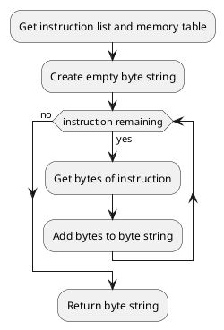

# Algorithms - assembler

This is a pseudocode breakdown of the assembler.

## Main function

The pseudocode for the main function is this:

```pseudocode
Run normalise_text()
Run split_into_sections()
Run divide_and_contextualise()
Run record_labels_and_variables()
Run place_memory_addresses()
Create empty byte string
Add result of encode_metadata() to bytecode
Add result of encode_instruction_list() to bytecode
If output format is "hex":
    Print as hex
Else if output format is "binstr":
    Print as binary string
Else if output format is "return":
    Return binary result
Else if output format is "file":
    Ask for file to print to
    Write bytecode to file
```

The UML diagram for the overall program is:



## normalise_text()

This function does the removal of comments and unnecessary whitespace.

```pseudocode
function normalise_text(text)
    lines = split(text)
    for i from 0 to lines.length:
        parts = split(lines[i], ";")
        lines[i] = parts[0]
    list non_blank
    for i from 0 to lines.length:
        if lines[i] != ""
            non_blank.append(lines[i])
    for i from 0 to non_blank.length:
        remove_whitespace(non_blank[i])
    string = non_blank[0]
    for i from 1 to non_blank.length
        string += "\n" + non_blank[i]
    return string
endfunction
```



## split_into_sections()

Takes normalised text and splits it into sections

```pseudocode
function split_into_sections(text)
    parts = split text on "section."
    parts_with_titles = []
    for i from 0 to parts.length:
        title_and_lines = split parts[i] on "\n", max=1
        parts_with_titles.append(title_and_lines)

    sections = new HashTable()
    for i = 0 to parts_with_titles.length:
        title = parts_with_titles[0]
        text = parts_with_titles[1]
        set sections["title"] to text

    return sections
endfunction
```



## divide_and_contextualise()

```pseudocode
functions (sections)
    config_dict = {}
    meta = split sections("meta") on "\n"
    for i from 0 to meta.length:
        parts = split(meta[i], "=")
        key = parts[0]
        value = parts[1]
        config_gict.set(key, value)

    instruction_list = []
    data = split sections("data") on "\n"
    for i from 0 to data.length:
        parts = split data[i] on "VAR"
        right_parts = split parts on " "
        name = parts[0]
        type = right_parts[0]
        initial = right_parts[1]
        add DataInstruction(name, type, initial) to instruction_list

    commands = split sections("text") on "\n"
    for i from 0 to commands.length:
        
endfunction
```



## record_labels_and_variables()

```pseudocode
```



## place_memory_addresses()

```pseudocode
```



## encode_metadata()

```pseudocode
```



## encode_instruction_list()

```pseudocode
```

