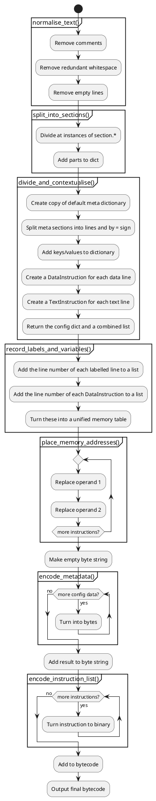

# Algorithms - assembler
This is a pseudocode breakdown of the assembler.

## Main function
The pseudocode for the main function is this:

```
Run normalise_text()
Run split_into_sections()
Run divide_and_contextualise()
Run record_labels_and_variables()
Run place_memory_addresses()
Create empty byte string
Add result of encode_metadata() to bytecode
Add result of encode_instruction_list() to bytecode
If output format is "hex":
    Print as hex
Else if output format is "binstr":
    Print as binary string
Else if output format is "return":
    Return binary result
Else if output format is "file":
    Ask for file to print to
    Write bytecode to file
```

The UML diagram for the overall program is:

