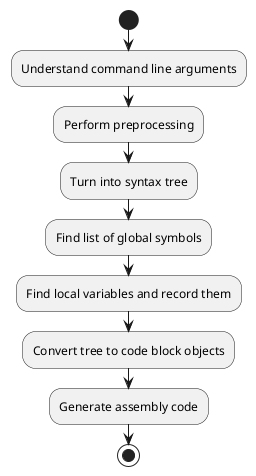
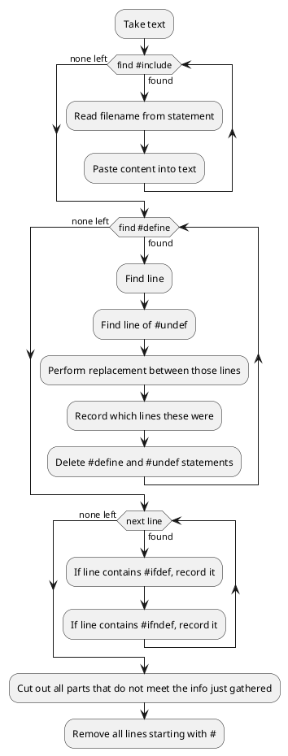
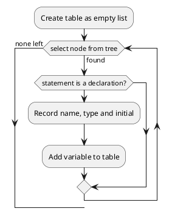
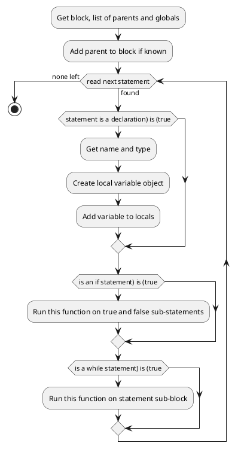
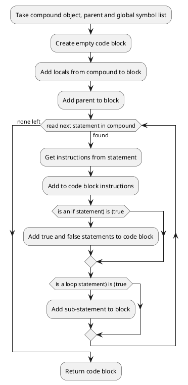
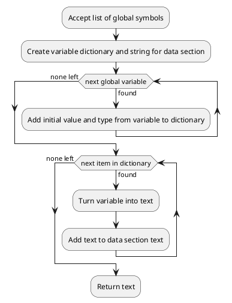

# Algorithms and structure - Compiler

The general overall structure of the compiler is this:



```pseudocode
procedure main(filename)
    file = openRead(filename)
    code = file.read()
    file.close()

    code = preprocess(code)
    tree = parse_tree(code)
    globals = parse_globals(tree)
    find_locals(globals)

    main_block = make_code_block(tree)
    assembly = "section.meta"
    assembly += write_meta()
    assembly += "section.data"
    assembly += write_data()
    assembly += "section.text"
    assembly += write_text()

    print(assembly)
endprocedure
```

## Preprocessor

```pseudocode
function preprocess(assembly)
    lines = split(assembly, "\n")

    while include_stmt_remaining():
        include_stmt = find("#include", lines)
        perform_include(lines, include_stmt)
    endwhile

    define_stmts = find_defines()
    for stmt in define_stmts:
        while define_match_remaining(lines, stmt):
            perform_replacement(lines, stmt)
        endwhile
    endfor

    replace_ifs()

    return lines.join()
endfunction
```



## Lexical and syntax analysis

This is all done by the pycparser library

## Global symbol parsing

```pseudocode
function global_symbols(tree)
    globals = HashTable()
    for subnode in tree:
        if subnode is definition:
            globals[subnode.name] = subnode.value
        endif
    endfor
    return globals
endfunction
```



## parse_compound()

```pseudocode
procedure parse_locals(tree)
    for subnode in tree:
        if subnode is declaration:
            tree.locals[subnode.name] = subnode.value
        endif

        if subnode has children:
            for child in subnode:
                parse_locals(child)
            endfor
        endif
    endfor
endprocedure
```



## generate_code_block()

```pseudocode
function make_code_block(tree)
    block = CodeBlock()
    for subnode in tree:
        block.extend(subnode.make_instruction())
    endfor
    return block
endfunction
```



## produce_data_section()

```pseudocode
function write_data(globals)
    code = ""
    for var in globals:
        line = "{name} VAR {type} {initial}"
        line.replace("{name}", var.name)
        line.replace("{type}", var.type)
        line.replace("{initial}", var.initial)
        code += line
    endfor
    return code
endfunction
```



## produce_text_section()

```pseudocode
function write_text(top_block)
    code = ""
    queue = Queue()
    queue.enqueue(top_block)

    while len(queue) != 0:
        block = queue.dequeue()
        code += block.write_code()
        for child in block:
            queue.enqueue(child)
        endfor
    endwhile

    return code
endfunction
```

```plantuml
:Accept top level block and global variable list;
:Create assembly text and code block queue;
:Write assembly code to move stack and base pointer;
:Add top block to queue;
while (accept next block in queue) is (found)
    :Get name and block from queue;
    :Run code generation function on block;
    :Write code to text section;
endwhile (none left)
:Write assembly to exit;
:Return assembly code;
```