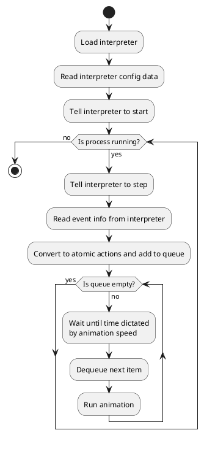

# Inter-process communication

This document describes the way that the GUI process will communicate with the individual processes. When run in GUI
form (since the individual programs can be run from the command line), the GUI program will spawn each sub-program as
necessary as a child process. It will then send instructions and requests for information through the child process's
stdin channel and listen to responses coming from its stdout. Anything coming from stderr will be printed into the GUI's
log file.

## Basic format

The basic format of the communication is that each part is separated by a space. The first part will be the general
instruction, and the next will either be the arguments of the instruction. Content being returned may not be quite in
this form - the only solid rule is that the title of the communication is what happens before the first space. It could
be followed by JSON or some other format.

## Communication with the compiler

Commands are not given to the compiler. The compiler simply runs and producs output in cplout.txt. The types of data returned are:

* start <data> - The compilation process has started, 

## Communication with the assembler

The following instructions can be given to the assembler via stdin:

* step - Moves one step. The steps are:
  * Starting text normalisation
  * Remove comments
  * Remove empty lines
  * Remove duplicate whitespace
  * Split into sections
  * Processing data section
  * Reading data section line
  * Understand data section line
  * Processing text section
  * Reading text section line
  * Understanding text section line
  * Beginning to detect labels and variables
  * Interpreted new variable
  * Interpreted new label
  * Calculating memory offsets
  * Placing memory address
  * Returning final bytecode

The types of data that can return are:

* start_text <text> - Starting text normalisation. Given text is the text (in str form, e.g. with \n for newlines), as the single element of an array.
* remove_comments <text> - Comments removed. Commentless text is given.
* remove_empty_lines <text> - Empty lines removed. Given result.
* remove_dup_wspace <text> - Removed duplicate whitespace. Given result.
* split <json> - Split the data into sections, given as \[meta, data, text] JSON.
* start_proc_meta - Starting to process the meta section
* read_meta_line <line> - Read a line of the meta section
* ustd_meta_line \[<desc>, <name>, <value>] - Understood the meaning of the meta line, given a description
* start_proc_data - Starting to process the data section.
* read_data_line <line> - Read a line of the data section.
* ustd_data_line \[<desc>, <name>, <dtype>, <initial>] - Understood the meaning of the data line, given a description.
* start_proc_text - Started to process the text section
* read_text_line <line> - Read the line of the text section
* ustd_text_line \[<desc>, <label>, <mnemonic>, <dtype>, <op1>, <op2>] - Understood the meaning of the data section line.
* start_lv_detect - Started detecting labels and variables
* found_var <name> <mrel> <type> - Found a variable. Give the name, location relative to data section start and data type.
* found_label <lname> <instrnum> - Found a label. Give the label name and instruction number.
* mem_offsets <dict> - Gives a JSON dict containing the results of the memory table.
* place_addrs - Placing memory addresses in their correct locations
* conv_meta <bytes> - Gives a JSON dict of the result of converting the meta section to bytes.
* conv_instr <opcode> <opbyte> <operand1> <operand2> - Gives the instruction as it has been conveted to bytes. Give the 
  operand and opbyte as an integer, and operand1 and operand2 as JSON arrays.
* end <final> - The process has ended and the bytecode been fully found. The JSON given is an array of the final bytecode.

## Communication with the interpreter

The interpreter will be started giving it the binary file through the -f command line argument, and the -i argument will
also be given, which tells the interpreter to act interactively, responding to instructions and giving output.

The commands given to the interpreter are:

* step - Moves on one step. The steps are:
  * Get opcode
  * Get operand byte
  * Decode operand byte
  * Read operand 1 data
  * Read operand 2 data
  * Switch statement entry
  * Execution function
* env - Prints out a "data" statement with the environment in JSON

The types of data that can return are:

* start - The initial setup procedures, as far as just about to get the first opcode
* fetch <pc> <opcode> <opbyte> <operand1> <operand2> - Got the opcode and operands from memory
* decode <chosen> - The switch statement has decoded what to interpret the opcode as
* exec_func <funcname> <args> - The relevant exec function has been run. It can be any of these:
  * cmp <val1> <val2> <p|n|e> - Ran a comparison function. For commentary, gives the values (decoded) and the register
    that was set to 1 as a result.
  * jmp <always|e|ne|lt|le|gt|ge> <addr> <true|false> - Any of the jump functions. Gives which jump
    instruction, along with the memory address to jump to, and whether the jump was made.
  * mov_reg <regname> <size> <srctype> <srcdata> <srccontent> - Moved data to a register. `srctype` is "maddr",  "reg" or
    "immediate". If it is "maddr" then `srcdata` is the memory address, if it is `reg` then it is a register name or if
    it is "immediate" then it is the immediate value. `srccontent` is the value extracted, as decimal bytes. 
  * mov_mem <destaddr> <size> <srctype> <srcdata> <srccontent> - Moved data to a memory address. The other arguments are
    the same as above.
  * lea_reg <regname> <addr> - Moved the given JSON data (`addr`) to the register of the specified name. 
  * lea_mem <destaddr> <addr> - Moved the given data to the given memory location.
  * arithmetic <opname> <type> <desttype> <dest> <op1> <op2> <res> - Performed a piece of arithmetic. `opname` is the
    name of the operation (e.g. "ADD" or "IDIV"). `type` is the type of the data, like `char`. `desttype` is either
    "maddr" or "reg", and then `dest` is either the register name or memory address depending on which `desttype` is
    given. Then `op1` and `op2` are the decoded values (in bytes) of the operands and `res` is the result.
* config <config_json> - Gives the content of the config dict in a JSON form
* data - Means that a JSON file containing the following information has been saved (env.json).
  * pc - The current value of the program counter
  * genregs - A nested JSON object with all of the registers ("eax", "ebx", etc)
  * cmp - A JSON object containing the values "e", "n" and "p", corresponding to those registers
  * memory - A JSON array of the full memory
  Naturally, this will be quite large.

The process by which the GUI reads information from the interpreter and turns it into basic animations is this:

