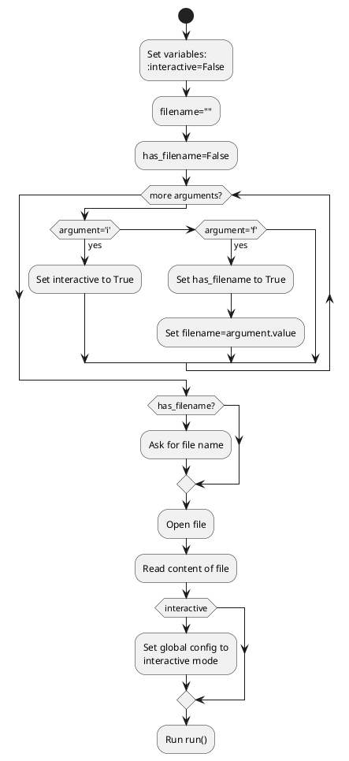

# Structure of the solution and algorithms - Interpreter

The pseudocode for the main function is this:

```pseudocode
interactive = False
filename = ""
has_filename = False

for arg in arguments
    if arg == 'i':
        interactive = True
    else if arg == 'f':
        has_filename = True
        filename = arg.value

if not has_filename:
    filename = input("Filename: ")

file = openRead(filename)
content = file.read()

if interactive_mode:
    config.interactive_mode = True

run(content, file.length)
```

The general UML activity diagram for this is:

