# Structure of the solution and algorithms - Interpreter

The pseudocode for the main function is this:

```pseudocode
interactive = False
filename = ""
has_filename = False

for arg in arguments
    if arg == 'i':
        interactive = True
    else if arg == 'f':
        has_filename = True
        filename = arg.value

if not has_filename:
    filename = input("Filename: ")

file = openRead(filename)
content = file.read()

if interactive_mode:
    config.interactive_mode = True

run(content, file.length)
```

The general UML activity diagram for this is:

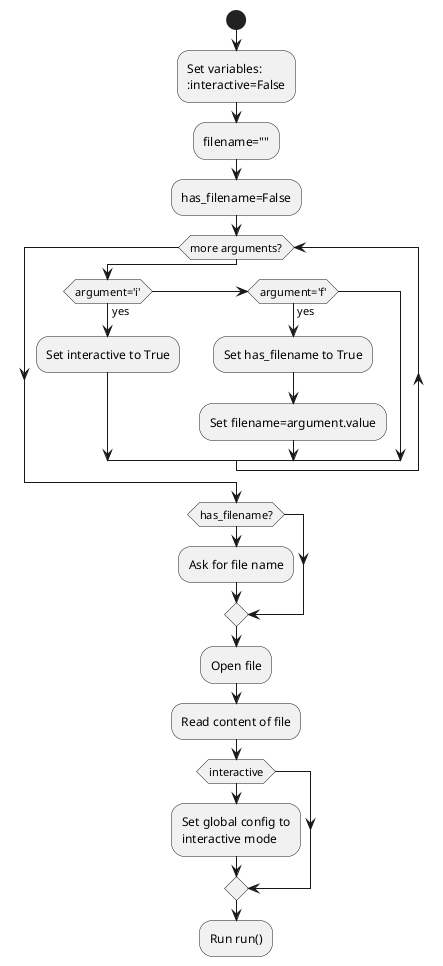

## main.c/run() function

The run() function is responsible for the setup of the program. It reads the config information from the start of the bytecode, then fills up the memory with the remainder:

```pseudocode
Run processConfig(bytecode)
config_length = result + 4

memsize = config.memorykb * 1024
env.memory = allocate_memory(memsize)
for i=0 to memsize:
    env.memory[i] = bytecode[i]

runLoop()
```

The corresponding activity diagram is this:

```plantuml
start

:Run processConfig();
:Add result to config_length;
:Set memsize to config.memorykb*1024;
:Allocate env.memory;

while (more bytecode?) is (yes) 
    :Add next byte to code;
end while (no)

:Run loop;
```

## main.c/runLoop()

This function Does a lot of work, handling the "fetch" section.

```pseudocode
while True:
    opcode = env.memory[env.pc]

    if opcode == 0 then
        break
    
    if opcode is char type then
        dtype = "b"
    else if opcode is uchar type then
        dtype = "B"
    else if opcode is short type then
        dtype = "h"
    else if opcode is ushort type then
        dtype = "H"
    else if opcode is int type then
        dtype = "i"
    else if opcode is uint type then
        dtype = "I"
    else if opcode is float type then
        dtype = "f"
    else if opcode is type 1 then
        dtype = "1"
    else if opcode is type 2 then
        dtype = "2"
    else if opcode is type 4 then
        dtype = "4"
    else:
        dtype = "n"
    
    env.pc = env.pc + 1
    operand_byte = env.memory[env.pc]
    op1_type = first 4 bits of operand_byte
    op2_type = last 4 bits of operand_byte

    op1_len = getOpLen(op1_type)
    op2_len = getOpLen(op2_type)

    array op1[op1_len]
    array op2[op2_len]

    env.pc = env.pc + 1
    for i from 0 to op1_len:
        op1[i] = env.memory[env.pc + i]
    env.pc = env.pc + op1_len
    for i from 0 to op2_len:
        op2[i] = env.memory[env.pc + i]
    env.pc += op2_len

    execute(above info)
```

The corresponding activity diagram is:

```plantuml
start
:Fetch opcode;
:Set data type based on opcode;
:Read operand byte;
:Get types of each operand;
:Find corresponding operand sizes;
:Read operand values into byte arrays;
:Run execute();
```

## main.c/execute()

A function where lots is done, but never all at once.

```pseudocode
switch opcode:
    case CMP:
        Run correct comparison function
    case JMP:
        Run exec_JMP()
    case JE:
        Run exec_JE()
    case JNE:
        Run exec_JNE()
    case JLT:
        Run exec_JLT()
    case JLE:
        Run exec_JLE()
    case JGT:
        Run exec_JGT()
    case JGE:
        Run exec_JGE()
    case MOV:
        Run correct move function
    case LEA:
        Run correct LEA function
    default:
        pass
    endswitch;
```

The UML diagram is this:

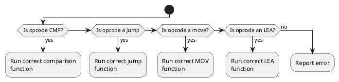

## commands.c/exec_CMP_*()

This is repeated several times using macros, but the code below is the general guide:

```pseudocode
diff = val1 - val2
env.cmp_n, env.cmp_e, env.cmp_p = 0

if diff < 0 then
    env.cmp_n = 1
else if diff == 0 then
    env.cmp_e = 1
else if diff > 0 then
    env.cmp_p = 1
```

With an activity diagram like this:

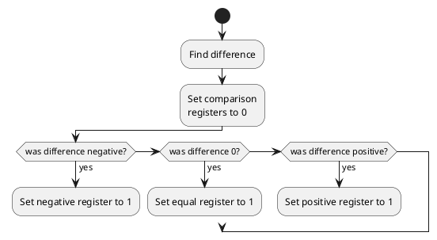

## commands.c jump functions

### JMP

```pseudocode
env.pc = address
```

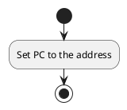

### JE

```pseudocode
if env.cmp_e is 1 then
    env.pc = address
```


### JNE

```pseudocode
if env.cmp_e = 0 then
    env.pc = address
```

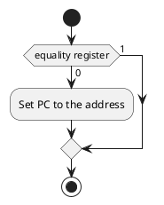

### JLT

```pseudocode
if env.cmp_n = 1 then
    env.pc = address
```


## JLE

```pseudocode
if env.cmp_n = 1 or env.cmp_e = 1 then
    env.pc = address
```

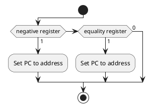

### JGT

```pseudocode
if env.cmp_p = 1 then
    env.pc = address
```

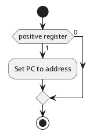

### JGE

```pseudocode
if env.cmp_p = 1 or env.cmp_e = 1 then
    env.pc = address
```

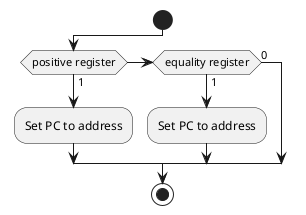

## commands.c/exec_MOV_reg

This function moves a certain number of bytes into a register.

```pseudocode
register_size = getRegisterSize(register_number)
bytes = allocate_memory(4)
if length == 1 then
    Move to_move to bytes[3]
else if length == 2 then
    Move to_move to bytes[2] and bytes[3]
else if length == 4 then
    Move to_move to bytes

Set register to bytes
```

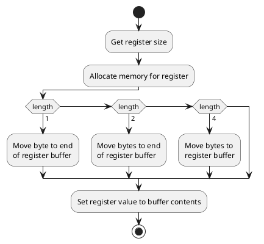

## `commands.c/exec_MOV_mem`

The next MOV function is to move data to the memory.

```pseudocode
for i from 0 to length:
    env.memory[address + i] = data[i]
```

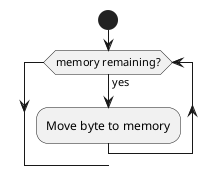

## `commands.c/exec_LEA_reg`

```pseudocode
function exec_LEA_reg(register, address)
    register_size = getRegisterSize(register)
    bytes = convertToBytes(address)

    if register_size == 1 then
        setRegisterValue(register, last in bytes)
    else if register_size == 2 then
        setRegisterValue(register, last 2 in bytes)
    else if register_size == 4 then
        setRegisterValue(register, bytes)
end function
```

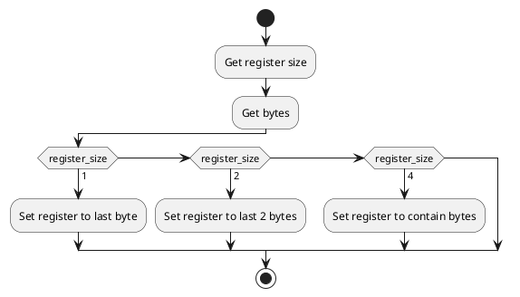

## `commands.c/exec_LEA_mem`

```pseudocode
function exec_LEA_mem(destination, from)
    bytes = convertToBytes(from)
    Set 4 bytes of memory
end function
```

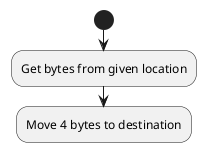